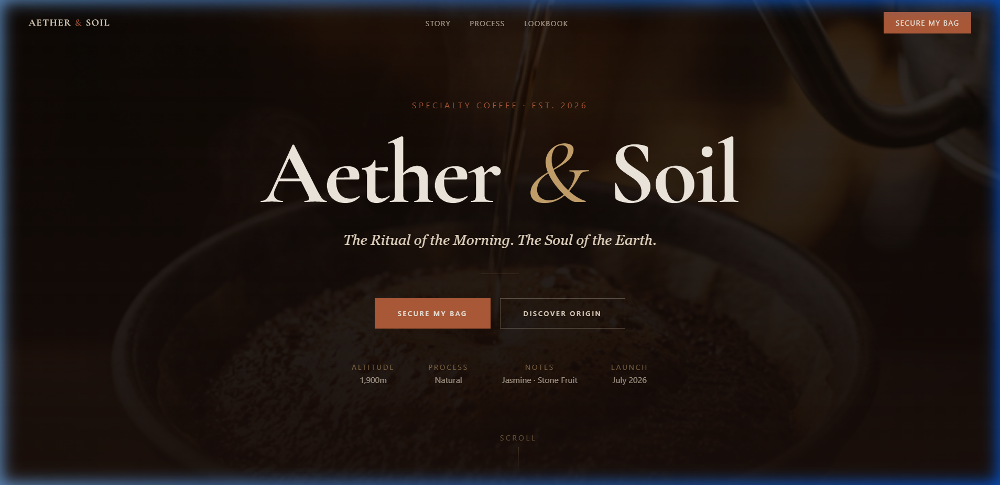

# Aether & Soil ☕✨

**The Ritual of the Morning. The Soul of the Earth.**

Aether & Soil is a premium, high-fidelity specialty coffee website designed to evoke a sense of luxury, craftsmanship, and tranquility. This project is a curated digital experience that showcases the artistry behind every bean.



## ✨ Features

- **Vibe Coded**: Designed with a focus on aesthetic harmony and emotional resonance.
- **Premium Design**: Modern, clean, and airy layout with high-quality imagery and sophisticated typography.
- **Dynamic Animations**: Smooth, fluid transitions and micro-interactions powered by Framer Motion.
- **Glassmorphic Elements**: Elegant use of transparency and blur effects for a modern UI.
- **Fully Responsive**: Optimized for a seamless experience across all device sizes.
- **Curated Sections**: Includes a Hero section, Story, Process (Bento Grid), Lookbook, and a Subscribe section.

## 🛠️ Tech Stack

- **Framework**: [React 19](https://react.dev/)
- **Build Tool**: [Vite](https://vitejs.dev/)
- **Styling**: [Tailwind CSS](https://tailwindcss.com/)
- **Animations**: [Framer Motion](https://www.framer.com/motion/)
- **Typography**: Cormorant Garamond, Syne, Instrument Serif, Space Grotesk.

## 🚀 Getting Started

To run this project locally, follow these steps:

1. **Clone the repository**:
   ```bash
   git clone https://github.com/your-username/aether-soil.git
   cd aether-soil
   ```

2. **Install dependencies**:
   ```bash
   npm install
   ```

3. **Run the development server**:
   ```bash
   npm run dev
   ```

4. **Build for production**:
   ```bash
   npm run build
   ```

---

*This project was vibe coded with ❤️ using [Antigravity](https://antigravity.google), [Stitch](https://stitch.google), and my imagination.*
